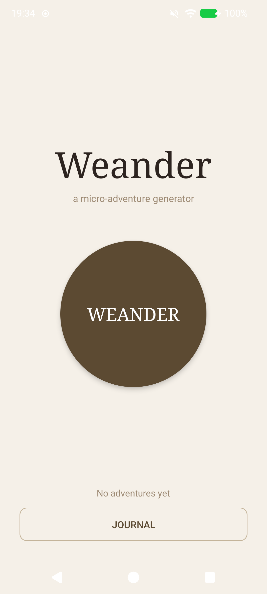
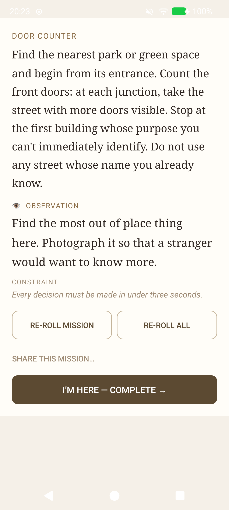

# Weander

[](LICENSE)

A creative micro-adventure generator for Android. Tap a button, get sent somewhere nearby with a creative mission. Go there. Do the thing. Document it. Build a personal journal of small adventures.

> "a curious friend handing you a creative dare"

<p align="center">
  
  &nbsp;&nbsp;&nbsp;
  
</p>

---

## What it does

1. **Weander** — tap the button. Either a random nearby destination (500m–2km) is picked using GPS, or — when GPS is unavailable or 30% of the time regardless — a procedurally generated walking strategy (a rule for how to navigate, a condition for when to stop)
2. **Go** — follow the OSMDroid map to your destination, with a live position dot; re-roll the mission if it doesn't spark anything
3. **Complete** — document with a photo, text, or audio recording
4. **Journal** — browse past adventures in a chronological feed, filter by category, or view all destinations on a map

Missions span six categories: Photo, Writing, Sound, Social, Creative, Observation. Over 90 hand-crafted missions, plus composable variants generated from component parts. Missions are weighted by time of day and season. A random creative constraint (35% chance) adds an extra layer of friction. Return missions activate when you revisit an area you have explored before.

---

## Building

The project runs entirely from a Nix shell — no Android Studio, no system-wide installs.

```bash
nix-shell          # enter the environment (JDK 17, Gradle, Android SDK)
make               # build debug APK
make install       # build and install on connected device
make run           # build, install, and launch
make logcat        # stream filtered logs (tag: Weander)
make clean         # remove build outputs
make distclean     # clean + wipe local Gradle cache
```

The debug APK lands at `app/build/outputs/apk/debug/app-debug.apk`.

---

## Tech stack

| Thing | Choice |
|---|---|
| Language | Java |
| Build | Gradle (via Nix shell) |
| UI | XML layouts, earthy palette, dark mode |
| Maps | OSMDroid 6.1.18 |
| Location | FusedLocationProviderClient |
| Storage | Room 2.6.1 |
| Min SDK | 26 (Android 8.0) |
| No backend | everything local-first |

---

## Project layout

```
app/src/main/java/it/lo/exp/weander/
  WeanderApp.java
  data/local/          # Room DB, DAO
  data/model/          # Adventure entity
  data/repository/
  missions/            # Mission, MissionPool, ConstraintPool, ReturnMissionPool
                       # NavigationStrategy, NavigationStrategyPool
  ui/home/             # HomeActivity — the "Weander" button + streak stats
  ui/adventure/        # AdventureActivity — map, live position, mission card
  ui/complete/         # CompleteActivity — camera / gallery / audio / text
  ui/journal/          # JournalActivity (filter chips, map button)
                       # AdventureDetailActivity, MapOverviewActivity
  util/                # Haversine, random nearby point, walk time
```

---

## Permissions

`ACCESS_FINE_LOCATION`, `CAMERA`, `RECORD_AUDIO`, `VIBRATE`, `WRITE_EXTERNAL_STORAGE` (API ≤ 28 only, for OSMDroid tile cache)

All requested at runtime; the app degrades gracefully if any are denied.

---

## License

Weander is free software, released under the [GNU General Public License v3.0](LICENSE).
